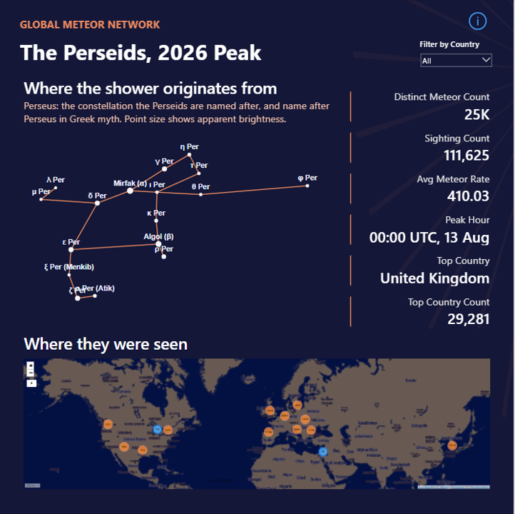

# Perseid Meteor Shower Dashboard


A Power BI dashboard built around the Perseid meteor shower's 2026 peak, using live data from the Global Meteor Network. Built as a portfolio piece to combine a custom Power Query function, DAX measures, and a from-scratch Deneb (Vega-Lite) visual - not just standard drag-and-drop visuals.

## Preview



The full working report is in `perseid-meteor-dashboard.pbix` at the repo root, once added - open it directly in Power BI Desktop to explore the visuals, queries, and measures firsthand.

## Customizing

**Changing the date range** - edit the `Dates` list at the top of `power-query/PerseidPeakData.pq`:
```
Dates = {#date(2026,8,11), #date(2026,8,12), #date(2026,8,13)},
```
Add, remove, or change dates as needed. Any date GMN hasn't published yet is skipped silently rather than erroring (see the note in that file). To pull a different meteor shower entirely, change the `"PER"` IAU code passed into `fnGetMeteorData` to the shower you want (e.g. `"GEM"` for the Geminids) - the function itself doesn't need to change.

**Changing the constellation** - the chart in `deneb/perseus-constellation.json` is hand-built for Perseus specifically; there's no dynamic swap built in. To chart a different constellation, you'd need to replace the `values` arrays (both the star positions/magnitudes and the connecting line pairs) with data for the constellation you want. See `docs/data-sources.md` for where the Perseus star positions and official line figure came from - the same two sources (Wikipedia/SIMBAD for star coordinates, the IAU stick figure data from `dcf21/star-charter`) cover all 88 constellations, so the same approach works for any of them.

## What's in this repo

- `power-query/` - the custom function (`fnGetMeteorData`) that pulls daily trajectory files live from GMN, plus the queries built on top of it (`PerseidPeakData`, `StationSightings`, `CountryLookup`)
- `dax/` - the DAX measures for sighting counts, top station/country, average meteor rate, and peak hour
- `deneb/` - the Vega-Lite spec for the Perseus constellation chart, with star positions and connecting lines sourced properly (see `docs/data-sources.md`)
- `assets/` - the background image used behind the report title
- `docs/` - data source references and notes

## How it works

`fnGetMeteorData(EventDate, IAUFilter)` takes a date and an optional IAU shower code (e.g. `"PER"` for Perseids), searches GMN's daily file directory for the matching file (filenames embed a solar-longitude range rather than being purely date-based, so this can't be guessed directly), downloads it, and returns a typed table of that night's meteor trajectories.

`PerseidPeakData` invokes that function across the shower's peak window and adds two derived columns (`InvertedMag`, for sizing map circles so brighter fireballs render bigger; `HourStart`, for grouping by hour). `StationSightings` unpivots the comma-separated list of detecting stations into one row per station per meteor, needed to rank stations and countries by sighting count.

The constellation chart is a hand-built Vega-Lite spec rendered through Power BI's Deneb visual - stars as sized points (brighter = bigger), connected by lines matching the official IAU constellation figure.

The geographic map uses Icon Map Pro (a licensed AppSource visual) rather than Deneb, since reliably rendering accurate country outlines inside Power BI's Deneb sandbox wasn't achievable without external map data, which the sandbox blocks.

## Known limitations

- GMN's daily files are provisional and get reprocessed over time - see `docs/data-sources.md`.
- The Icon Map Pro basemap can't be recoloured to exactly match the report's navy/ember palette, since it's provider tile imagery, not something styleable to an arbitrary hex value.
- Two faint connector stars in the official constellation figure don't have individual names and were simplified out - see `docs/data-sources.md`.

## Built

Started as a "couldn't sleep, had to build it" Friday night idea in August 2026, around the actual Perseid peak.
